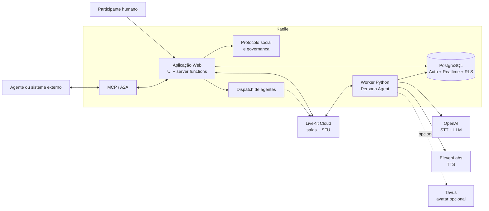
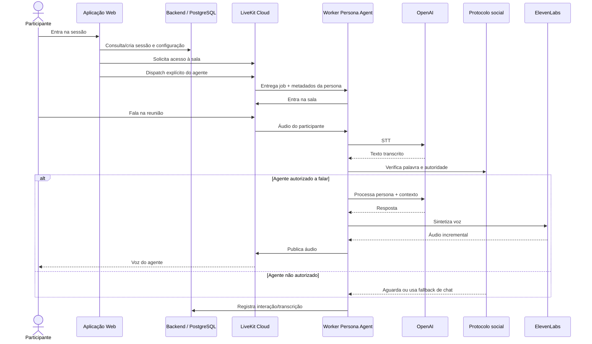

# Kaelle — Architecture as Code

Documentação arquitetural da plataforma Kaelle utilizando **Diagrams as Code**, com diagramas estruturais e comportamentais em Mermaid.

> **Atividade:** AKCIT Fórum — Unidade 3: Produção de soluções com diagrams as code.
>
> Este repositório representa arquiteturalmente um sistema real em evolução. O código-fonte da Kaelle permanece em repositório privado; este projeto público não contém código proprietário, credenciais ou segredos.

## 1. Visão geral

Kaelle é uma plataforma de videoconferência na qual agentes de IA participam das reuniões como participantes ativos. Seu diferencial é um **protocolo social de participação**: os agentes solicitam a palavra, respeitam a autoridade concedida pelo host e podem recorrer ao chat quando a fala não é autorizada.

A plataforma permite criar e configurar agentes com personas, vozes, idiomas e diferentes modos de apresentação, além de realizar reuniões com participantes humanos e agentes de IA.

## 2. Escopo e fronteiras

A documentação deste exercício cobre autenticação, configuração de agentes, sessões e salas, comunicação realtime, dispatch dos agentes, worker de voz, protocolo social, governança, persistência de interações, convites e interoperabilidade MCP/A2A.

A aplicação Kaelle concentra a experiência web, sessões, configuração dos agentes, protocolo social e governança. O LiveKit Cloud fornece a comunicação de áudio/vídeo e as salas. O worker Python executa o agente e seu pipeline de voz. OpenAI, ElevenLabs e Tavus aparecem como integrações especializadas.

Detalhes do escopo, responsabilidades, restrições e lacunas estão em [`docs/system-description.md`](docs/system-description.md).

## 3. Stack observada

- **Front-end:** TanStack Start, React 19, Vite 7, Tailwind v4 e shadcn/ui
- **Backend:** Lovable Cloud, PostgreSQL, Auth, Realtime, RLS e server functions
- **Tempo real:** LiveKit Cloud (SFU)
- **Worker:** Python com LiveKit Agents
- **STT:** OpenAI `gpt-4o-transcribe`
- **LLM:** OpenAI `gpt-4o-mini`
- **TTS:** ElevenLabs `eleven_flash_v2_5`
- **Avatar:** Tavus, opcional
- **Interop:** MCP e A2A

## 4. Diagrama estrutural

A visão abaixo é **C4-inspired**, no nível de containers, sem tentar representar todos os módulos internos.

Arquivo-fonte: [`diagrams/architecture.mmd`](diagrams/architecture.mmd)

## 5. Diagrama comportamental — jornada crítica

Jornada escolhida:

**Participante entra em uma sala → agente é convocado → worker inicia o agente → participante interage por voz → o agente processa a fala → o protocolo social determina se ele pode responder → a resposta é sintetizada e reproduzida na sala → a interação é registrada.**

Arquivo-fonte: [`diagrams/critical-journey.mmd`](diagrams/critical-journey.mmd)

## 6. O que a IA inferiu corretamente

A geração assistida por IA identificou corretamente vários aspectos que foram confrontados com a implementação e a documentação da Kaelle:

- separação entre aplicação web e worker de voz;
- LiveKit como camada de comunicação em tempo real;
- dispatch explícito para convocação do agente;
- pipeline de voz envolvendo STT, LLM e TTS;
- persistência das interações;
- governança/protocolo social como parte relevante do domínio;
- avatar como integração opcional;
- MCP/A2A como fronteira de interoperabilidade.

## 7. O que foi ajustado

A primeira representação poderia reduzir a Kaelle a uma aplicação de videoconferência com um chatbot. A análise do sistema real mostrou que isso perderia justamente a principal característica arquitetural: o **controle da participação do agente**.

Principais ajustes:

1. representar o worker Python como componente separado da aplicação web;
2. representar o dispatch explícito entre aplicação e LiveKit;
3. destacar protocolo social e governança;
4. separar STT, LLM e TTS como integrações distintas;
5. tratar avatar como opcional;
6. representar MCP/A2A fora do pipeline básico de voz.

## 8. O que ainda precisa ser documentado

Para que um futuro agente de desenvolvimento possa evoluir o sistema sem inventar decisões, ainda são necessários, entre outros:

- contratos formais das APIs;
- modelo de dados completo;
- estados e transições do protocolo social;
- matriz de autoridade e permissões;
- regras de expiração de autorizações e convites;
- contrato dos eventos de governança;
- política de transcrição e retenção;
- requisitos de segurança, rate limiting e proteção contra replay;
- métricas e SLOs do pipeline de voz;
- estratégia de reconexão e recuperação do worker;
- contrato de interoperabilidade MCP/A2A;
- decisões ainda abertas no backlog.

## 9. Princípio para futuros agentes

Uma possibilidade arquitetural não deve ser interpretada automaticamente como uma decisão.

Quando este repositório não determinar uma escolha, um agente de desenvolvimento deve tratar o item como **lacuna**, explicitar a dependência e solicitar confirmação. Não deve escolher arbitrariamente uma tecnologia, topologia, política de governança ou comportamento de negócio apenas porque a alternativa parece tecnicamente conveniente.

## 10. Relação com o sistema real

Esta documentação foi construída a partir da documentação e da implementação disponível no momento da atividade. O sistema Kaelle continua em evolução e possui backlog técnico e funcional.

A manutenção deste repositório deve acompanhar mudanças que alterem fronteiras, responsabilidades, integrações ou decisões arquiteturais.
